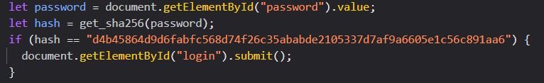
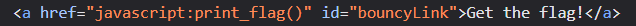
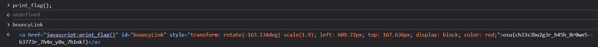

---

**Name**: hash-browns

**Category**: web

**Points**: 50 (1 flag)

**Description**:
Welcome to the OSUSEC CTF League! The goal of each of these challenges is
to find a flag that will be in the form osu{n0t_a_fL4g}. When you capture the flag,
submit it in Discord using /submit &lt;flag>. To start, open the linked website in your
browser. Good luck!

---

## **Flag 1**

Upon opening the page, I was met with a short description and a login panel. Inspecting the page like the challenge description suggests, you can find this line of code that checks the password entered by the user against the exposed, unsalted hash. 

Incidentally, the site also had a link to [CrackStation](https://crackstation.net/), a password hash cracker that compares user submitted hashes against a massive lookup table of known hashes of common passwords. Using this site with the exposed hash returns the password “cheeseburger”, which can be used to login to the site. 

After logging in, I was met with an alert that says “Catch me if you can!” and then a blank page with the words “Get the flag” bouncing around the screen like the DVD screensaver. The first thing I noticed was that the mouse cursor changed when hovering the bouncing text, so it could be clicked on as a link, presumably revealing the flag. After a few minutes of trying, I clicked the bouncing text and it changed to the flag, still bouncing around. Using the console, I printed the contents of the bouncing text and got the flag. 

After getting the flag, I wanted to find an easier way to reveal it without having to struggle to click on it. Looking at the code, I saw that clicking on the bouncing link ran the function print_flag().  

Running this print_flag() function in the console revealed the flag, and printing the bouncyLink object let me read the flag and submit it. 

