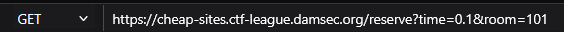
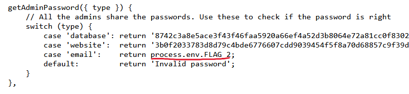
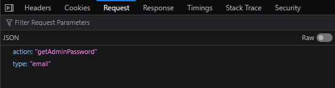
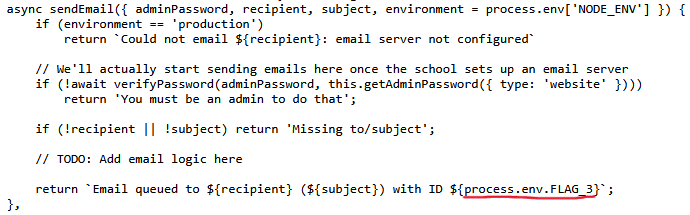
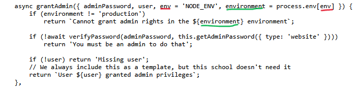
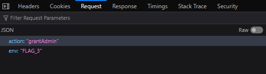

---

**Name**: cheap-sites

**Category**: web

**Points**: 150 (3 flags)

**Description**:
I need to reserve a room for my club meeting tomorrow, but I'm not very good at math and my high school thinks I'm AI! Can you help me reserve a room?

---

## **Flag 1**

In part 1 of the challenge, we can see that the flag is sitting in the GET method of /reserve:

    app.get('/reserve', (request, response, next) => {
    const BOOKED_ROOMS = new Set([103, 214, 343]);

    // If we didn't get the needed parameters, handle as a static file
    if (!request.query.time || !request.query.room) {
        next();
    }

    // Everything should be numbers
    const time = parseFloat(request.query.time, 10);
    const room = parseFloat(request.query.room, 10);
    if (isNaN(time) || isNaN(room)) {
        return response.status(400).send("Hmmm");
    }

    // If they solved the Turing Test too slow, they're probably an AI model trying to figure it out
    if (time > 0.125) {
        return response.send("That took wayyy too long, are you AI?");
    }

    // Make sure the room is valid
    if (room in BOOKED_ROOMS) {
        return response.send("That room is not available");
    }

    BOOKED_ROOMS.add(room);
    response.send(`You successfully booked room ${room}. Your confirmation code is ${process.env.FLAG_1}; please show this to the front desk to pick up your key.`);
});

Clicking on the reserve button makes a math problem pop up, and solving it sends the request but you can see in the code that if the time parameter is >0.125 Seconds, the flag won’t be given. Modifying the parameter to be 0.1 and resending the request like this is enough to get the flag. 

---

## **Flag 2**

Parts 2 and 3 take place on [https://cheap-sites.ctf-league.damsec.org/admin.html](https://cheap-sites.ctf-league.damsec.org/admin.html) and we have new code to look through for all the actions an admin can take. Looking for the flag we see that it is in the getAdminPassword() function that has parameter “type”:

So to get the flag all we have to do is send a post request with action getAdminPassword and type email:

---

## **Flag 3**

Looking for the third flag in the code, it is found in the sendEmail() function:

However, getting to that point in the code requires getting past the verifyPassword() function, which after some testing, is not possible. After looking at the other possible actions for possible vulns, our team settled on exploiting the grantAdmin() function:

Specifically, the first if statement, which prints an environment variable supplied by the env parameter. From the sendEmail function we know the flag is stored in the env variable “FLAG_3”, so by sending a request with the action : grantAdmin and env : FLAG_3, we get the flag: 

