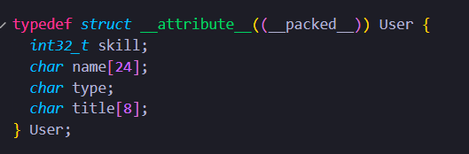
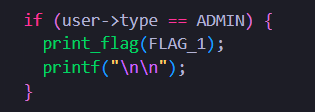
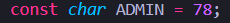
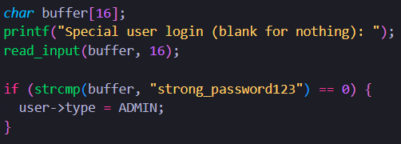
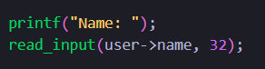
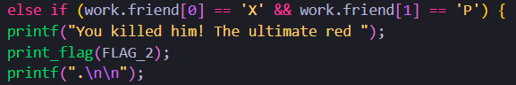
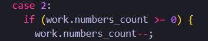
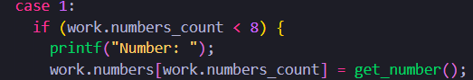
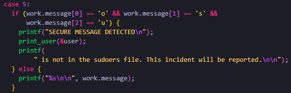
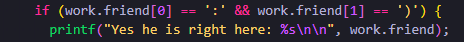

---

**Name:** friendly-work 

**Category:** pwn 

**Points:** 170 (3 flags) 

**Description:** C is a great language. My number summing app will be so fast and efficient. With no bugs right?

---

## **Flag 1**

For the first flag, we are working with the User struct: 

And the first flag is located here (above), so our goal is to set the user type attribute to ADMIN, which is a char constant equal to 78, or the character ‘N’. 

There is a way to do this included in the code, but it is impossible because the size of the buffer is smaller than the value it is being checked against (“strong_password123”), so the buffer will never be equal and this is just a red herring. 

Instead, there is a vulnerability earlier in the code when getting the name of the user:

This is because the program is reading 32 bytes of input from the user and storing it in user->name, which is only 24 bytes. 
> Because the struct has "\_\_attribute\_\_((\_\_packed\_\_))", the attributes of the struct are stored directly next to each other in memory and we don't have to worry about padding bytes. 

So, if the user was to input more than 24 bytes (or characters, since 1 char = 1 byte), they would overflow into the type and title attributes of User. Therefore, if the user entered “aaaaaaaaaaaaaaaaaaaaaaaaN” as their name, the 25th character ‘N’ would be stored in the title attribute of User, and we get our first flag. 

---

## **Flag 2**

The second and third flags have to do with the other struct, Work:

And our second flag is here:

So our goal is to set the first two chars of the friend attribute of Work to “XP__”. Since the first attribute of Work is just an int, we can’t overflow into friend like for the previous flag. Instead, if the program allows it, we can overflow backwards from the numbers[] array. Luckily, the program has just the vulnerability:

If the user chooses to remove a number (case 2), the program decrements the numbers_count attribute. Since the if statement checks for >= 0, this can be done when the count is already 0, setting it to -1. 

With that, the user can add a number (case 1):

Which sets the number at numbers[number_count] to a user inputted number. Because the number_count is -1, it is pointing 1 32 bit integer backwards, or 4 bytes back, which happens to be the start of the friend attribute. Now, the user just has to input a number that corresponds to “XP” in ascii, which is 20568 or 88 + 80*256, to get the flag.  

---

## **Flag 3**

Flag 3 is located here:

Where if the user sets the message attribute to the required string, the third flag is read into the message and overwrites what was there previously. The code has functionality to do this, so it is very easy, but there is a second problem to solve:

If the user tries to read the message, and it starts with “osu” (which the flag does), it won’t get printed out. After some searching I decided it was impossible to overflow into the message from the previous attribute since it is an array of numbers and there is no way to index past it. Instead, there is a different print statement that can be exploited:

This statement prints out friend, which we know from flag2 can be modified to anything we want, which includes removing the null terminator so more is printed afterward. So I overwrote friend to be “:):)” which is equivalent to 691677498. Now, friend has no null terminator but the print still stops at the numbers array. So, I filled the numbers array with more 691677498’s for simplicity, and now printing the friend also prints the contents of the numbers array, then the message:

