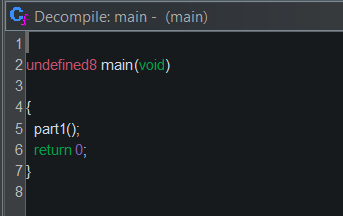
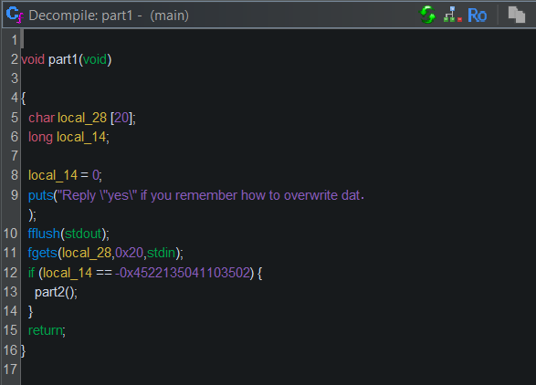
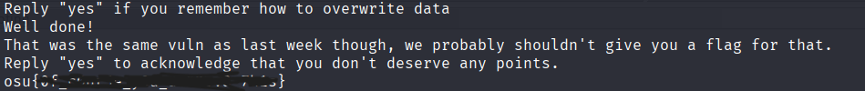

---

**Name**: ret2win

**Category**: pwn

**Points**: 150 (1 flag)

**Description**:
I learned an important lesson last week: I can't run any code that gives a flag or those pesky h4x0rs will steal it right away. My latest creation never even calls its win function; that'll trip them up for sure!

---

## **Flag 1**

For this challenge, the first thing I did was throw the provided binary into ghidra. 

The main function just calls part1():

Looking at this function, if we want to call part2(), input has to be equal to ‘\xbeefcafe’ or  -0x4522135041103502. Since there is no direct way to change the value of `input`, it will have to be done with a buffer overflow. Ghidra tells us that input is only 1 byte away from `buffer`, and the `fgets` reads up to 32 bytes, which is plenty to work with. I did this by writing a python script that uses pwntools to inject input into the process:
 
    p = remote("ret2win.ctf-league.damsec.org", 1304)

    offset = 20                      
    target = -0x4522135041103502     
    payload = b"A" * offset + p64(target, signed=True)

    p.sendline(payload)
    p.interactive()

With that, the part2() function gets called. In ghidra, it looks like this: \

Similar to part1(), but the function just returns after getting user input, there are no other functions called. However, there is a win() function, as hinted about in the challenge description, it just never gets called. Using the fact that the fgets reads 100 bytes, we can overflow the buffer like before, except this time the goal is to overwrite the return address of the function to be the address of the win() function. I did this by writing 40 bytes of junk (32 for the buffer, 8 for the rbp above the buffer) then the address of the win() function I got by looking at the disassembly. I removed the interactive line and added this to my script:

    win_addr = 0x400687
    payload = b"A" * 40 + p64(win_addr)   # 32 buffer + 8 saved RBP = 40
    p.sendline(payload)

    p.interactive()

And just like that:

