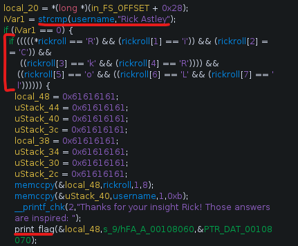
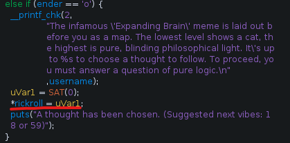
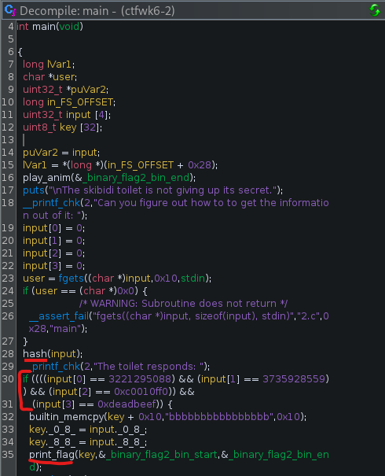

---

**Name**: adventure

**Category**: rev

**Points**: 150 (3 flags)

**Description**:
Get ready for an adventure of 3 exceedingly possible challenges.
This week’s challenge was the first rev challenge, with 3 different binaries to reverse. My basic strategy was to work backwards from where the flag gets printed and figure out how I could get the program to execute that code. 

---

## **Flag 1**

Here is the first important piece of part 1:

This piece of code will call the print flag function only if the `username` variable =  “Rick Astley” and the `char* rickroll` = “RiCk RoLl”. The first part of this, username, was easy since the program asks the user for the username, but changing rickroll was harder. 

The intent of this program is like a choose your own story, where it prints out blocks of text and then lets the user make a choice. In the code, some of these blocks of text are special, because they call another function after they have been printed. The function they call, named SAT, allows the user to change the value of char* rickroll one index at a time. 

After each block, the user can choose which next block to go to by looking through the code then inputting the corresponding number (which gets converted to a char). So, we can navigate to all 8 blocks that change the 8 indices of `char* rickroll` to be what we want, then end the story by entering '0' and have the print_flag function be called. 

## **Flag 2**

For part 2, everything we need is in the main function:

The print_flag() function is at the bottom, and to get it to run we need to pass the if statement check just before it. One important thing to note for part 2 is that it was compiled with debug symbols, which means that variable names can be used in a program like gdb. One cool thing I learned from this challenge was that variables can be assigned different values during runtime with gdb, which is the main exploit of this part. To print the flag, we just have to set a breakpoint in gdb right inbetween the hash function and the if statement, and change the value of input to match the if. It was a bit tricky to find exactly where to put the breakpoint but I ended up doing b *main + 141, then changing input with ‘set var input[0] = 3221295088’ and so on for the rest.

## **Flag 3**

For part 3, I can’t lie, I was a little lost. With the help of my team and the coaches, I learned the general idea was to use gdb to change the value of the rip register to skip over functions that the program control flow would normally get stuck in. However, unlike the previous two challenges, there was no function labeled print_flag() or anything similar, and the decompiled code wasn't friendly, so I wasn’t completely sure where the flag was getting printed and where I wanted to jump to. So, my strategy involved jumping to different places in the code and seeing what happened. Most of the time, this just ended with a segafault, but eventually I landed in the right place. The magic number that worked for me was setting rip to *main+83, where the program picks up right after the first unpassable function and right before the second. From there, the user just has to input a few numbers and solve some basic addition and the flag will be printed. The flag does get removed from the screen right after however, so I had to do a quick ^C to stop the program once it was printed.