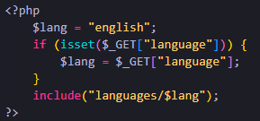
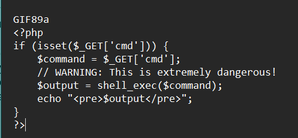
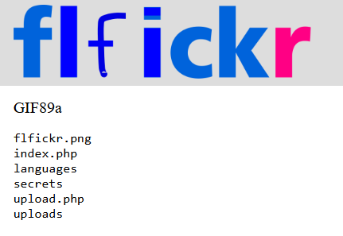

---

**Name**: flfickr

**Category**: web

**Points**: 125 (1 flag)

**Description**:
Welcome to the latest and greatest image sharing platform, flfickr!

---

## **Flag 1**

The first thing I did with this challenge was explore the website. It is a simple site, with functionality for the user to upload a photo, and view the site in a different language. However, I noticed that the language is chosen from a parameter in the url, which can be exploited if not sanitized. 

In the code, there is no sanitization, so the user can type anything in the url parameter and the site will include the code from it. If only we could upload our own code…

What we can upload is photos, which the site does a few checks on like checking the file size and extension. Unfortunately for the site, these checks are possible to get around, and I learned from my teammate that the easiest file to spoof in this case was a gif. It only requires one line at the top of the file to be interpreted as a real .gif file by the site. Here was my simple.gif that I uploaded:

The first line with “GIF89a” is what's important for passing this as a gif, and the rest gets a command from a url parameter and executes it (thanks chatgpt for the code and the warning lol).

With this file uploaded, it can be included with the vulnerability of the language parameter by navigating to: 

*https://flfickr.ctf-league.damsec.org/?language=../uploads/simple.gif*

Then the command can be included as a second parameter like:

*https://flfickr.ctf-league.damsec.org/?language=../uploads/simple.gif&cmd=ls*

And now I can execute commands on the server (output of ls):

Using ls, find, grep, cat, and whatnot, I was able to locate the flag file and print it out to complete this challenge. 
