---

**Name**: sm-winter

**Category**: pwn

**Points**: 160 (3 flags)

**Description:**
Welcome to Super Memory World (Winter Edition)! Each level has 2 flags - one for the normies, and one for the l33t. Can you get them all? I hear there may even be another one, but I don't see any evidence of that…

---

## **Flag 1**

For this flag, we are working with level 1. The read_flag() function call is located in the handleMovement() function, in a switch based on the players position: 

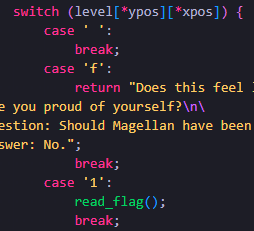

Basically, if the player is standing on ‘1’, it gives the flag. 

Looking at the whole [level layout](https://chal.ctf-league.osusec.org/pwn/super_memory_winter/level1/level1.txt) provided in the text file, we can see that the ‘1’ is on the far right, behind a seemingly unpassable wall. Luckily, there is a vulnerability in the code: 

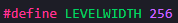

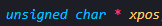

The X position of the player is stored in an unsigned char, so if there was a way to get out of bounds on the left side into the negative x values, the char would wrap around to 255, essentially teleporting the player like screen wrap in an old 2d game. 

Here is the route I used to get out of bounds: 

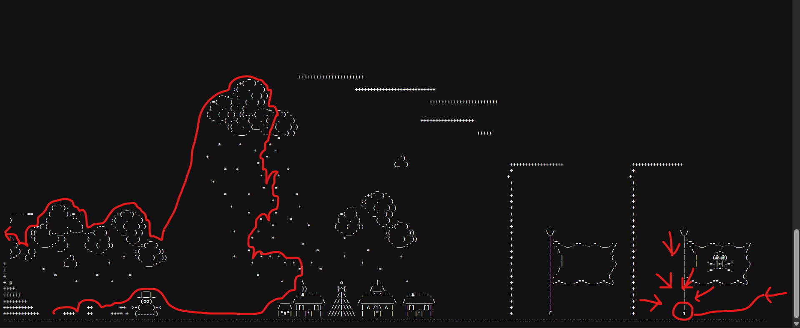

Where I was able to reach the real flag in the game and get the flag for the challenge.  
 
---

## **Flag 2**

For this flag, we are working with level 2. This level has a similar [layout ](https://chal.ctf-league.osusec.org/pwn/super_memory_winter/level2/level2.txt)as the first one, where we must get to the real flag at the end of the level blocked by a wall. There are also new features in this level, including picking up keys to get past locked doors, and picking up money. 

This time, we are blocked by a ‘[‘ character, which has the special property paid_unlock: 

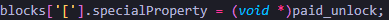

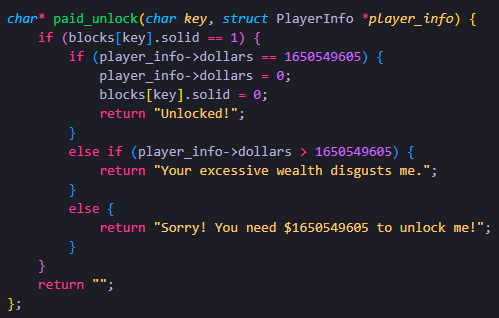

Looking at this function, we need exactly 1650549605 dollars if we want to get past this wall, and there are definitely not that many in the level. Once again there is a vulnerability in the code that lets us exploit our money: 

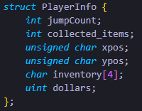

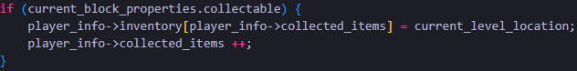

The code for adding keys to the inventory doesn’t check the remaining space in the inventory before adding them, so picking up more than 4 keys will overflow them into the dollars variable.  
 
Converting the 1650549605 dollars needed to hex gets 62616365 or 62 61 63 65 as bytes, which happens to correspond to ‘b’ ‘a’ ‘c’ ‘e’ in ascii. Unfortunately, there is no ‘e’ key to pick up in the level. However this can easily be replaced with a ‘b’, leaving the player 3 dollars short, which can be picked up in the level while grabbing the ‘d’ key, which is needed to reach the flag anyway. 

One last thing I had to figure out was that the program is run on a 32 bit little endian system, so the order we pick up the keys needs to be reversed, becoming ‘b’ ‘c’ ‘a’ ‘b’, then grabbing the ‘d’ key after doesn’t affect the dollars variable since it is only 4 bytes. 

Last thing for real this time, there are two bytes of padding between the inventory and dollars variables, so the 3rd key grabbed after filling the inventory is the first one to overflow into dollars. This is important for flag 3.

So my solution was to grab the a,b,c keys then grab 3 junk keys, then b,c,a,b then 3$ and d then I was able to pass through the ‘[‘ gate and reach the flag in the game and get the flag for the challenge. 

---

## **Flag 3**

For this flag, we are working with level 2, and are provided with the binary. The challenge description hints at a hidden flag, and throwing the binary in Ghidra, we can see a hidden function that didn’t show up in the code: 

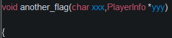

I didn’t paste the whole function, but it just prints out flag 3, and it is never called anywhere in the program.  
 
One peculiar thing I noticed was the function’s section header in Ghidra:

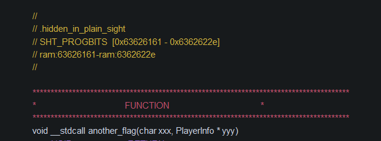

This function is in the section “.hidden_in_plain_sight” and is located at the address 0x63626161. That address corresponds to “cbaa” in ascii.  
 
With this info, if we could use the buffer overflow exploit from flag 2 and overflow all the way back to the return address and make it ‘cbaa’, we could jump to the another_flag() function and print the third flag. The hard part is figuring out exactly how much to overflow and how many bytes are between the player’s inventory and the return address.  
 

The PlayerInfo struct where the inventory is located is in the runGame function:

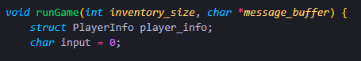

And we can get some helpful information from Ghidra again: 

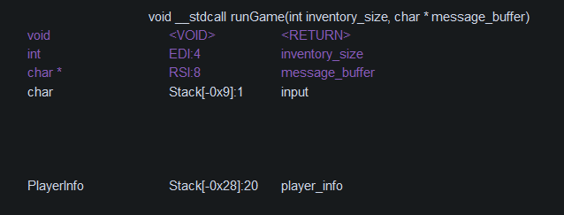

The input variable is at the 9th byte below the stack frame, and player_info is at the 40th. Since the PlayerInfo struct is only 20 bytes, this tells us there is 11 bytes of padding between input and player_info since without the padding, player_info would be at the 29th byte instead of the 40th. 

Here is a diagram my teammate made breaking down the memory layout: 

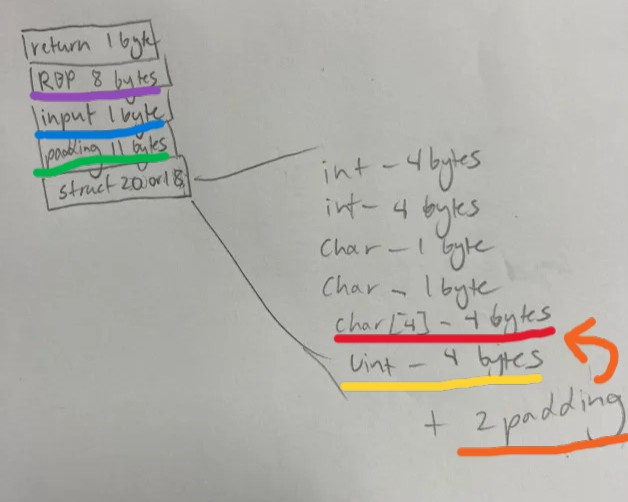

Starting count after the 4 bytes of the inventory, there are 2 bytes of padding , 4 bytes for dollars, 11 bytes of padding, 1 byte for input and 8 bytes for rbp, for a total of 26 bytes in between the end of the inventory and the return address. 

>Earlier I said this was run on a 32 bit system, which is incorrect since there is rbp instead of ebp. However, ints are still 4 bytes in memory.

This can be confirmed with GDB:

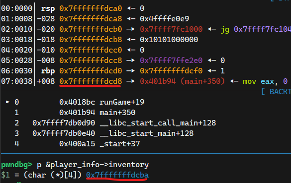

The difference between the address of the inventory and the address of the return address is d8-ba which is 30, minus the 4 bytes of the inventory is 26. 
 
One last thing to add is the runGame() function executes in this while loop:

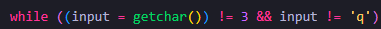

So once we have overwritten the return address, we can press ‘q’ to end the function and return to the another_flag() function to get the flag. 
 
Bringing it all together, I grabbed the a, b, and c keys, then 1 more to fill up the inventory, then 26 junk keys. Then the keys a, a, b, c (backwards cuz little endian), then I pressed q to quit the function and return to the another_flag() function to print flag 3 and finish the challenge.  